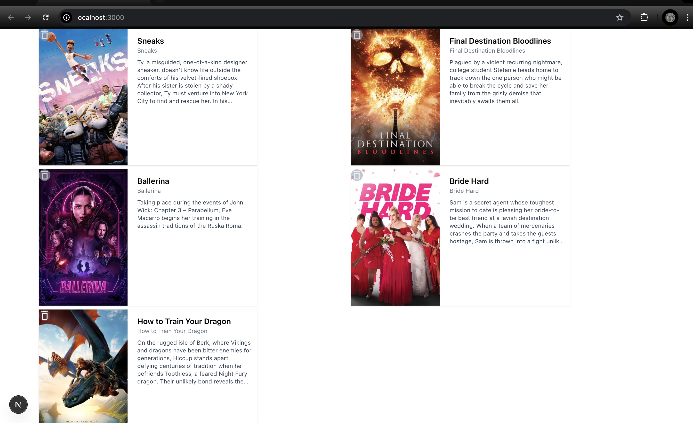

### demo image


### tech
animation ul

- docs  [mtion.dev](https://motion.dev/)
```bash
npm install framer-motion
```


### eviroment variable
```bash

NEXT_PUBLIC_CLIENT_API_KEY= Your API Keys


NEXT_PUBLIC_CLIENT_WEB_URL=https://api.themoviedb.org/3


NEXT_PUBLIC_CLIENT_IMAGE_BASE_URL=https://image.tmdb.org/t/p/w500


NEXT_PUBLIC_CLIENT_TOKEN_KEY= Credentials Header (token)

```


### Delete method
```ts
"use client";
import { MdDeleteOutline } from "react-icons/md";
import { useDeleteMovie } from "@/hook/useDeleteMovie";

import { useState } from "react";

const DeleteBtn = ({ id }: { id: string }) => {
  const [deleting, setDeleting] = useState<boolean>(false);
  const [tokenKey, setTokenKey] = useState<string | null>(null);

  const { deleteMovieRating } = useDeleteMovie()

  const handleDelete = async () => {
    setDeleting(true);

    if (typeof window !== "undefined") {
      const token = localStorage.getItem("guest_session_id");
      if (token) {
        setTokenKey(token);
      }
    }

    try {
      if (!tokenKey) {
        alert("token is do not has");
        return;
      }
      if (!id) {
        alert("id don't has");
        return;
      }

      const result = deleteMovieRating({
        movieId: id,
        token: tokenKey
      })

      console.log("Deleted successfully:", result);
    } catch (err) {
      console.error("បរាជ័យក្នុងការលុប rating", err);
    } finally {
      setDeleting(false);
    }
  };

  return (
    <div className="group-hover">
      <div
        className="absolute top-0 left-0 w-6 h-6 bg-gray-400/60 hover:bg-gray-400/20 rounded-full flex justify-center items-center cursor-pointer"
        onClick={!deleting ? handleDelete : undefined}
      >
        <MdDeleteOutline className="text-2xl text-white/70 hover:text-white" />
      </div>
    </div>
  );
};

export default DeleteBtn;
```

#### Change any type
```ts
ប្រើ any គឺ គ្មានសុវត្ថិភាព ហើយ TypeScript គឺត្រូវការបញ្ជាក់ type ដើម្បីដឹងថាតើ structure នៃ data របស់ prev ជាអ្វី។ ខ្ញុំនឹងជួយបងកែតម្រូវឲ្យបានត្រឹមត្រូវដោយបង្កើត Type សម្រាប់ data របស់ TMDB API rated/movies។

✅ បង្កើត Type សម្រាប់ Movie Rated Response
ts
Copy
Edit
// types.ts (ឬដាក់ក្នុង file component ដែរ)
export interface RatedMovie {
  id: number;
  title: string;
  overview: string;
  poster_path: string;
  vote_average: number;
  release_date: string;
}

export interface RatedMovieResponse {
  page: number;
  results: RatedMovie[];
  total_pages: number;
  total_results: number;
}
✅ កែ mutate() ដោយប្រើ type ត្រឹមត្រូវ
ts
Copy
Edit
import { RatedMovieResponse } from "@/types"; // បើបង្កើតក្នុង fileផ្សេង

mutate(
  [`https://api.themoviedb.org/3/guest_session/${guestSessionId}/rated/movies`, process.env.NEXT_PUBLIC_TMDB_TOKEN],
  (prev: RatedMovieResponse | undefined): RatedMovieResponse | undefined => {
    if (!prev) return prev;

    return {
      ...prev,
      results: prev.results.filter((movie) => movie.id !== id),
    };
  },
  false
);
```